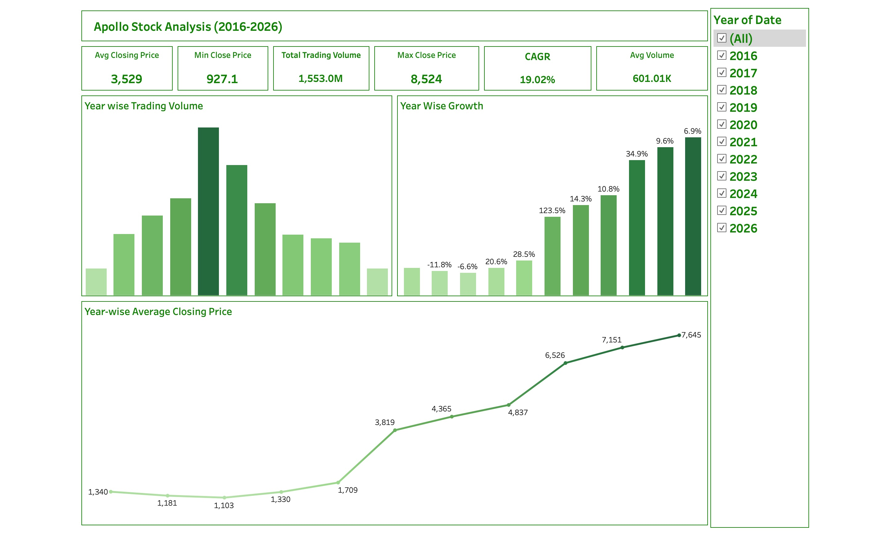

Apollo Hospitals Stock Analysis

Overview

This project analyzes Apollo Hospitals stock performance from 2016–2026 using Python, SQL, Pandas, and Tableau. The objective was to identify long-term trends, calculate growth metrics, and generate business insights from historical stock market data.

Tools Used

• Python
• SQL
• Pandas
• Tableau

## Dashboard Preview

Dashboard Features

• Average Closing Price Analysis
• Trading Volume Analysis
• Year-wise Growth Rate
• CAGR Calculation
• Interactive Year Filter

Key Insights

• CAGR: 19.02%
• Average Close Price: ₹3,529
• Maximum Close Price: ₹8,524
• Strong growth observed after 2020
• Consistent long-term upward trend in stock performance

Files Included

• Apollo_Report.pdf
• apollo_analysis.ipynb
• apollo.csv
• dashboard.png
